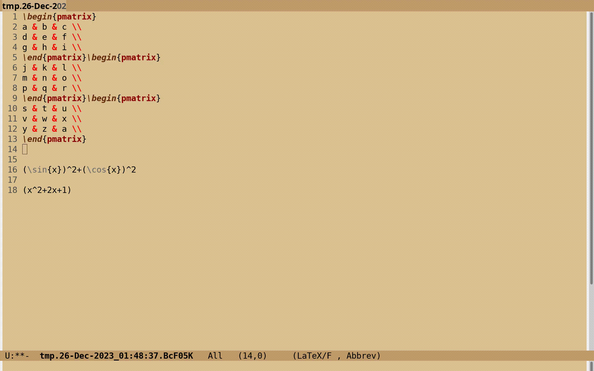

# compuTeX
Convert LaTeX -> SymPy -> evaluate -> LaTeX in Python3 and GNU Emacs.

## Dependencies
1. [Install Python3](https://www.python.org/downloads/) (tested using `v3.11.2`).
2. [Install SymPy](https://docs.sympy.org/latest/install.html) (tested using `v1.11.1`).
3. The Python3 package `antlr4-python3-runtime`. Please follow the installation instructions
   [here](https://docs.sympy.org/latest/modules/parsing.html#runtime-installation). The version of
   `antlr4-python3-runtime` recommended on this webpage might differ from your requirement: for
   example, I needed version `v4.10` for `SymPy v1.11.1`. Please run the following Python code
   before installing `antlr4-python3-runtime` to determine the desired version.
   ```python
   >>> from sympy.parsing.latex import parse_latex
   >>> parse_latex("\int")
   ```
4. Optional: [Install GNU Emacs](https://www.gnu.org/software/emacs/).

## Setup
1. Clone this repository.
2. Copy the file `computex.py` to some directory that is in the `PATH` environment variable
   of your Operating system.

## Help
Run `computex.py -h` to get help.

## Usage
Create a file named `matsq.tex` with the following contents:
```latex
\begin{pmatrix}
a & b \\
c & d \\
\end{pmatrix}^2
```
and another one named `matmult.tex` with the following contents:
```latex
\begin{pmatrix}
a & b \\
c & d \\
\end{pmatrix}\begin{pmatrix}
e & f \\
g & h \\
\end{pmatrix}
```
Now, try the following commands in a UNIX shell:
```sh
$ cat matsq.tex | computex.py
$ cat matmult.tex | computex.py
```
Try these to print the output in equation form:
```sh
$ cat matsq.tex | computex.py -e
$ cat matmult.tex | computex.py -e
```
If you are using Windows and do not have `cat`, then try using the `type` command instead.

## Setup for GNU Emacs
This step is optional.

1. If you wish the key bindings to be available in all buffers, then add
   the following to your emacs Initialization File:
   ```elisp
   (setq computex-file "/path/to/computex.el")
   (if (file-exists-p computex-file)
       (progn (load computex-file)
              (global-set-key (kbd "C-`") sgang-computex-map)))
   ```
   If you are using emacs 29 or above, then consider using `keymap-global-set`
   instead of `global-set-key`.
2. If you wish the key bindings to be available only in `latex-mode` of
   [AUCTeX](https://www.gnu.org/software/auctex/), then add the following
   to your emacs Initialization File instead:
	```elisp
   (setq computex-file "/path/to/computex.el")
   (if (file-exists-p computex-file)
       (progn (load computex-file)
              (eval-after-load 'latex
                '(define-key LaTeX-mode-map (kbd "C-`") sgang-computex-map))))
	```
3. Optional: Change the ``"C-`"`` above to any key you wish.

## GNU Emacs usage

1. Select the LaTeX code to evaluate (excluding any `$`-sign or other math delimiters).
2. Call any of the functions `sgang-tex-computex-*` defined in `computex.el`. Assuming
   that ``C-` `` is bound to `sgang-computex-map`, type ``C-` `` followed by:
   - the key `z` for `sgang-tex-computex` corresponding to `computex.py -e`,
   - the key `e` for `sgang-tex-computex-expand` corresponding to `computex.py -e -E`,
   - the key `f` for `sgang-tex-compute-factorize` corresponding to `computex.py -e -f`,
   - the key `s` for `sgang-tex-compute-simplify` corresponding to `computex.py -e -s`.



## Acknowledgment
This idea was borrowed from [symtex.el](https://github.com/ultronozm/symtex.el)
authored by [@ultronozm](https://github.com/ultronozm).
